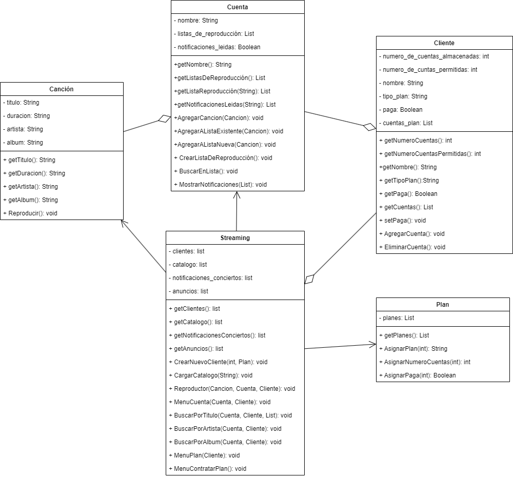

Alan Torres Aguilar 2223028388

Gustavo Angel Morales Vigi 2223029054

DIAGRAMA:
https://github.com/AGN-Teaching/proyecto-equipo-2/issues/2#issue-1944381817

Informe sobre el Sistema de Streaming de Música

Introducción
El presente informe se centra en el diseño y desarrollo de un sistema de streaming de música, una plataforma que permite a los usuarios acceder y disfrutar de música en línea. Este proyecto aborda diversos aspectos, desde la gestión de cuentas de usuario hasta la reproducción de canciones y la creación de listas de reproducción personalizadas. A lo largo de este informe, analizaremos en profundidad el problema que intentamos resolver, presentaremos las conclusiones derivadas de nuestro análisis, describiremos en detalle el diseño de la solución, explicaremos cómo funciona el sistema y, finalmente, exploraremos las clases involucradas, sus relaciones y posibles mejoras.

Análisis del Problema

El problema central al que nos enfrentamos es la creación de una aplicacion de un sistema de streaming de música que ofrezca una experiencia completa y atractiva a los usuarios. Esto implica resolver los siguientes desafíos:

Gestión de Usuarios y Cuentas: Los usuarios deben poder registrarse, iniciar sesión y acceder a sus cuentas de usuario. También deben poder elegir entre diferentes planes de suscripción. Entre estos planes incluye el poder crear una cierta cantidad de cuentas/perfiles, ademas de poder eliminar dichas cuentas, estos pueden ser de tipo premium o gratuito, los perfiles premium tienen el privilegio de reproducir musica sin anuncios, mientras que los gratuitos no cuentan con este privilegio.

Catálogo de Música: El sistema debe contener un catálogo de canciones con información detallada, como título, duración, artista y álbum. Los usuarios deben poder buscar y acceder a estas canciones.

Reproducción de Canciones: Los usuarios deben poder reproducir canciones y, en función de su plan de suscripción, pueden estar sujetos a anuncios publicitarios, ademas que, durante la reproducción puedan agregar la cancion a una lista de reproducion nueva o existente.

Listas de Reproducción Personalizadas: Los usuarios deben poder crear y gestionar sus propias listas de reproducción con canciones de su elección.

Diseño de la Solución
La solución propuesta se basa en una arquitectura orientada a objetos

Podemos destinar una clase llamada Streaming para la Gestión de Usuarios y Cuentas ademas del manejo de las funciones en general con el uso de menús que permitan mostrarle al usuario una interfaz con la que pueda interactuar con el sistema, esto mediante metodos, uno de estos se destinaria al menú principal el cual permita contratar planes y acceder a usuarios existentes, otro menú cuando se accede al usuario para poder gestionar las cuentas y el ultimmo menu para cada cuenta, este permitiria hacer busquedas de musica por titulo de canción, artista, álbum y lista de reproducción . Esta clase puede contener el Catálogo de Música del sistema y una forma de poder acceder a ella mediante una busqueda, que, a como lo pide el problema esta se puede hacer mediante titulo de canción, artista, álbum, esto implica tener un metodo para la busqueda de cada atributo de la cancion, ademas de tener un reproductor para reproducir la musica contenida en el.

Para la musica se considera que se pueden hacer búsquedas por titulo de canción, artista, álbum y lista de reproducción, estos se considerarian como atributos de la canción, y con esto obtenermos la clase Cancion que ademas puede tener un metodo para reproducirse.

Dado que cada cancion es un objeto, para el manejo del catalogo se usara un archivo JSON, que facilita guardar parametros para resuparar las intancias de una clase.

Al conntratar un plan ya sea de tipo gratuito o premium, este debe estar asociado a un usuario, este usuario tiene la capacidad de crear cuentas/perfiles, y poder gestionalas, esto incluye poder almacenar, agregar nuevas cuentas y eliminarlas, ademas que dependiendo el plan contratado las cuentas pueden ser limitadas. Esstas caracteristicas podemos destinarlas a una clase llamada Cliente, que tambien debe tener un nombre, y saber si el cliente contrato el plan premium

Para asignar propiedades al crear instancias de la clase Cliente como tipo de plan, numero de cuentas permitidas y si el plan es de paga, se creara la clase, Plan que tiene estas funciones, esto con el fin de facilitar el paso de los parametros al crear las intancias antes mencionadas, esta estrategia se implementaria al contratar nuevos planes.

Podemos destinar una clase llamada Cuenta, la cual debe poder almaceanar listas de reproduccion y que tambien pueda agregar canciones en listas existentes y agregar a listas nuevas, tambien debe tener un metodo para buscar dentro de estas listas, ademas de mostrar notificaciones proporcionadas por el sistema

Teniendo lo anterior podemos pasar a la contrucion de cada clase:

Clase Streaming:
Descripción: Esta clase es el corazón del sistema y coordina todas las operaciones. Gestiona clientes, cuentas, notificaciones, funciones de busqueda en el catálogo de música y en listas de reproduccion, la reproducción de canciones y la gestion de anuncios.
Métodos y Funciones: Incluye métodos para mostrar menús para contratar un plan, plan y para cada cuenta, crear cuentas de usuario, cargar el catálogo de canciones desde un archivo JSON, reproducir canciones y hacer las distintas busquedas por titulo de canción, artista y álbum .

Clase Cliente:
Descripción: Representa a los usuarios y sus planes de suscripción. Cada cliente puede tener múltiples cuentas.
Métodos y Funciones: Permite la creación y eliminacion de de cuentas y la gestión de planes de suscripción.

Clase Cuenta:
Descripción: Representa una cuenta de usuario individual y almacena información sobre las listas de reproducción.
Métodos y Funciones: Gestiona la creación y eliminacion de listas de reproducción, agregar canciones y la busqueda de musica en sus listas de reproduccion.

Clase Canción:
Descripción: Representa una canción en el catálogo de música. Contiene detalles como título, duracion, artista y álbum.
Métodos y Funciones: Reproducirse.

Clase Plan:
Descripción: Asigna valores como el tipo de plan contratado, la cantidad de cuentas permitidas y si el tipo de plan es de paga, su objetivo es de uso exclusivo para la reacion de instancias de la clase Cliente

La relacion de las clases seria la siguiente manera:

La clase Streaming tendria relacion de agregacion con la clase Cliente ya que los clientes forman parte de la plataforma streamig pero pueden seguir existiendo estando separadas

La clase Streaming tendria relacion de asosiacion con la clase Cuenta, ya que este la usa para hecer la busqueda en listas de reproduccion

La clase Streaming tendria relacion de asosiacion con la clase Cancion ya que usa a la case para reproducir la cancion

La clase Streaming tendria relacion de asosiacion con la clase Plan ya que usa a la case para crear instancias de la clase Cliente

La clase Cliente tendria relacion de gregacion con la clase Cuenta ya que las Cuentas forman parte del Cliente pero pueden seguir existiendo estando separadas

La clase Cuenta tendria relacion de gregacion con la clase Cancion ya que las Canciones se almacenan el listas de la clase Cuenta pero pueden seguir existiendo estando separadas

Teniendo todo esto podemos crear el diagrama UML

Diseño UMl

Funcionamiento e Implementación
El sistema opera de la siguiente manera:

Cuando el usuario accede al sistema y se le muestra un menú donde se muetra el nombre de la alplicacion y los clientes dipoibles si es que los hay, el usuario puede elegir entre contratar un plan de suscripción o acceder a uno existente.
Para contratar un plan, el usuario proporciona su nombre y elige el tipo de plan (Gratuito, Individual, Estudiantes, Familiar).
El menú se muestra de la sigguiente manera:

VIAL
Una app de streaming de musica sin sonido...

Clientes:
cliente    Tipo de plan

Menú Principal
1. Acceder con usuario
2. Contratar plan
3. Salir

Ingresa una opción:

Cuando un cliente accede a su plan existente, el sistema verifica su nombre, busca y recupera la instancia de Cliente correspondiente, accediendo al menú para clientes y solicitando una opcion al usuario que se muestra de la siguiente forma:

Menú Plan
1. Crear cuenta/perfil
2. Eliminar cuenta
3. Acceder a una cuenta existente
4. Salir
Ingresa una opción:

Este menú permite a los usuarios crear cuentas de usuario individuales con nombres únicos, eliminarlas y acceder al menu de la cuenta el cual se muestra a continuacion:

¡Nuevas notificaciones!
ve a la seccion de notificaciones

Menú cuenta     Cuenta: angel
1. Buscar por Título
2. Buscar por Artista
3. Buscar por Álbum
4. Buscar en lista de reproducción
5. Crear lista de reproducción
6. Notificaciones
7. Cerrar sesión

El menú muestra un mensaje de notificaciones nuevas en la parte superior
Los usuarios pueden buscar canciones por título, artista o álbum, lo que implica una búsqueda en el catálogo de canciones.
La busqueda por lista se realiza usando la cuenta que se encuentra abierte en ese momento.
La reproducción de canciones se realiza a través de un reproductor y muestra si hay notificaciones nuevas y anuncios si el plan del usuario lo permite.
Tambien permite elegir entre dos opciones, agregar a una lista de reproduccion, que esta lleva a un submenú donde las opciones son agregar a una lista existene o a una lista nueva.
En el menu cuenta los usuarios pueden crear listas de reproducción personalizadas y agregar canciones a ellas, ademas de acceder al apartado de notificaciones, despues de acceder a este el mensaje de notificaciones desaparece del menü de la cuenta

Cada menú y submenú que muestra el codigo tine la opcion de salir, permitiendo regresar al principio y salir del programa.

Descripción y Análisis de las Clases
Cada clase cumple un papel fundamental en el funcionamiento del sistema:
La clase Streaming coordina todas las operaciones y gestiona las relaciones entre los clientes, las cuentas, el catálogo y la reproducción.
La clase Cliente permite la gestión de usuarios y sus planes de suscripción, lo que influye en la disponibilidad de anuncios.
La clase Cuenta administra las cuentas de usuario individuales y las listas de reproducción personalizadas, lo que ofrece una experiencia única a cada usuario.
La clase Canción es esencial para el catálogo de música, permitiendo la búsqueda y reproducción de canciones.
La clase Plan es de uso exclusivo para la creacion de intancias de la clase Cliente

Posibles Mejoras
A pesar de la robustez de la solución propuesta, existen áreas que podrían mejorarse:
Seguridad: La implementación actual no aborda la autenticación de usuarios ni la protección de datos sensibles. Mejorar la seguridad es fundamental.

Escalabilidad: Con un crecimiento significativo de usuarios y canciones, la arquitectura actual podría volverse ineficiente. Una optimización para la escalabilidad es esencial.

Recomendaciones de Música: La incorporación de algoritmos de recomendación podría mejorar la experiencia del usuario.

Justificación de Relaciones entre Clases
Las relaciones entre las clases están diseñadas para representar de manera efectiva la interacción entre los componentes del sistema. Por ejemplo, la clase Cliente actúa como un "contenedor" para las cuentas de usuario individuales, lo que refleja la relación de "uno a muchos". La clase Cuenta se relaciona con la clase Canción para permitir la creación de listas de reproducción personalizadas. La clase Streaming coordina todas las operaciones y actúa como el "centro de mando" del sistema.
Conclusiones
Tras un análisis exhaustivo de los desafíos y requisitos, hemos llegado a las siguientes 

CONCLUSIONES:
La gestión de cuentas de usuario es esencial para personalizar la experiencia de cada usuario y administrar sus preferencias.El catálogo de música debe estar bien organizado y permitir una búsqueda eficiente de canciones.
La reproducción de canciones debe ser fluida y puede requerir la gestión de anuncios.Las listas de reproducción personalizadas permiten a los usuarios crear su propia experiencia musical.
El sistema de streaming de música desarrollado ofrece una solución completa y eficiente para permitir a los usuarios acceder y disfrutar de música en línea. A través de una gestión de cuentas, un catálogo de música organizado, la reproducción de canciones y la creación de listas de reproducción, se abordan los principales desafíos y requisitos del proyecto. Además, las posibles mejoras identificadas permiten un camino claro para futuras actualizaciones y expansiones.

El sistema, basado en una arquitectura orientada a objetos, proporciona una base sólida para brindar una experiencia musical atractiva y personalizada a los usuarios. Sin embargo, se recomienda encarecidamente mejorar la seguridad y abordar la escalabilidad para garantizar un funcionamiento óptimo a medida que el sistema crece. Además, la implementación de recomendaciones de música podría llevar la experiencia del usuario a un nivel superior.

